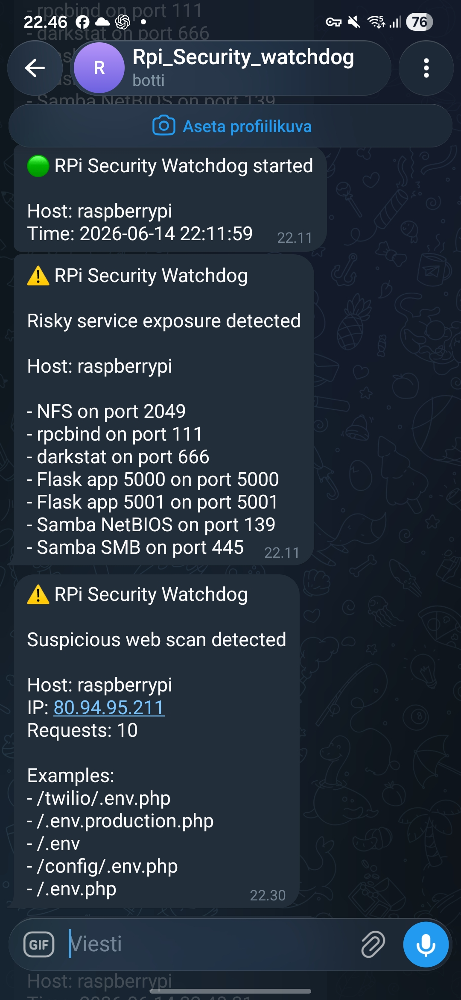

# Raspberry Pi Security Watchdog

Lightweight Raspberry Pi security watchdog for SSH and Nginx monitoring with Telegram alerts.

## Features

* SSH login monitoring
* SSH pre-auth connection detection
* Nginx suspicious request detection
* Telegram alerts for non-whitelisted SSH logins
* Telegram alerts for suspicious web scans
* Per-IP scan tracking and alert thresholds
* Persistent event logging
* Systemd service support
* Logrotate support

## Real-World Detection Example

The watchdog detected a real-world automated web scan targeting exposed `.env` files and other common configuration paths.

After the configured threshold was reached, a Telegram alert was generated automatically.



### Example Event

Source IP:
- 80.94.95.211

Detected Activity:
- Multiple `.env` probes
- Laravel environment file scans
- Configuration file discovery attempts

Watchdog Response:
- Suspicious requests counted
- Alert threshold reached
- Telegram notification sent
- Event written to persistent log

## Monitored Events

### SSH

The watchdog monitors:

* Successful SSH logins
* Pre-auth SSH connections
* Logins originating from non-whitelisted networks

### Nginx

The watchdog detects:

* Requests for sensitive files such as:

  * `.env`
  * `.git/config`
  * `wp-config.php`
  * AWS credentials
  * SSH keys
  * Configuration backups

The watchdog groups requests by source IP and sends Telegram alerts when a configurable threshold is reached.

## Requirements

* Raspberry Pi OS or other Linux distribution
* Python 3
* Nginx
* Telegram Bot API token
* Telegram chat ID

## Installation

Clone the repository:

```bash
git clone https://github.com/i-xul/raspberry-pi-security-watchdog.git
cd raspberry-pi-security-watchdog
```

Install dependencies:

```bash
pip3 install pyyaml
```

Create configuration:

```bash
cp config/config.example.yaml config/config.yaml
```

Edit configuration and add:

* Telegram bot token
* Telegram chat ID
* Allowed networks

Start manually:

```bash
python3 watchdog/security_watchdog.py
```

## Systemd Service

Install service:

```bash
sudo cp systemd/raspberry-pi-security-watchdog.service /etc/systemd/system/
sudo systemctl daemon-reload
sudo systemctl enable --now raspberry-pi-security-watchdog.service
```

Check status:

```bash
systemctl status raspberry-pi-security-watchdog.service
```

## Log Files

Watchdog events are stored in:

```text
logs/security_watchdog.log
```

Systemd logs:

```bash
journalctl -u raspberry-pi-security-watchdog.service -f
```

## Roadmap

Planned future improvements:

- Top attacker IP tracking
- Telegram command support, such as `/top_ips`
- GeoIP enrichment for suspicious IP addresses
- Weekly security summary reports
- Fail2ban integration
- TLS certificate expiration monitoring
- Optional firewall audit support for UFW, iptables and nftables
- Web dashboard and JSON API for recent events and statistics

## License

This project is licensed under the MIT License.

